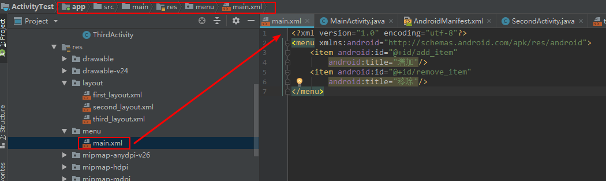

android first

------

- 


------

- `D:\myWork\android_wSpace\HelloAndroid\app\src\main\AndroidManifest.xml`

```xml
<?xml version="1.0" encoding="utf-8"?>
<manifest xmlns:android="http://schemas.android.com/apk/res/android"
    package="com.example.helloandroid">

    <application
        android:allowBackup="true"
        android:icon="@mipmap/ic_launcher"
        android:label="@string/app_name"
        android:roundIcon="@mipmap/ic_launcher_round"
        android:supportsRtl="true"
        android:theme="@style/AppTheme">
        <!--
            activity表示 注册活动 没有在AndroidManifest.xml里面注册的活动是不能使用的
            其中 init-filter 里面的两行代码表示 MainActivity 是这个项目的主活动,启动应用时先加载该活动
        -->
        <activity android:name=".MainActivity">
            <intent-filter>
                <action android:name="android.intent.action.MAIN" />

                <category android:name="android.intent.category.LAUNCHER" />
            </intent-filter>
        </activity>
    </application>

</manifest>
```

---

- `D:\myWork\android_wSpace\HelloAndroid\app\src\main\java\com\example\helloandroid\MainActivity.java`

```java
package com.example.helloandroid;

import android.support.v7.app.AppCompatActivity;
import android.os.Bundle;

public class MainActivity extends AppCompatActivity {

    /*
        该方法时活动被创建时必定被执行的方法
     */
    @Override
    protected void onCreate(Bundle savedInstanceState) {
        super.onCreate(savedInstanceState);
        //setContentView 是给该活动引入一个 activity_main 的 layout 布局
        // 布局文件是放在res/layout 下面的
        setContentView(R.layout.activity_main);
    }
}

```

---

- `D:\myWork\android_wSpace\HelloAndroid\app\src\main\res\layout\activity_main.xml`

```xml
<?xml version="1.0" encoding="utf-8"?>
<android.support.constraint.ConstraintLayout xmlns:android="http://schemas.android.com/apk/res/android"
    xmlns:app="http://schemas.android.com/apk/res-auto"
    xmlns:tools="http://schemas.android.com/tools"
    android:layout_width="match_parent"
    android:layout_height="match_parent"
    tools:context=".MainActivity">

    <TextView
        android:layout_width="wrap_content"
        android:layout_height="wrap_content"
        android:text="Hello World!"
        app:layout_constraintBottom_toBottomOf="parent"
        app:layout_constraintLeft_toLeftOf="parent"
        app:layout_constraintRight_toRightOf="parent"
        app:layout_constraintTop_toTopOf="parent" />

    <TextView
        android:id="@+id/textView"
        android:layout_width="wrap_content"
        android:layout_height="wrap_content"
        android:layout_marginStart="8dp"
        android:layout_marginEnd="8dp"
        android:layout_marginBottom="84dp"
        android:text="myapp"
        app:layout_constraintBottom_toBottomOf="parent"
        app:layout_constraintEnd_toEndOf="parent"
        app:layout_constraintHorizontal_bias="0.474"
        app:layout_constraintStart_toStartOf="parent" />

</android.support.constraint.ConstraintLayout>
```

---

## 项目中的资源 `res` 文件夹

-  `values` 下面的 `strings.xml` 文件

```xml
<resources>
    <string name="app_name">HelloAndroid</string>
</resources>
```

- 在这里定义了一个 `app_name` 的字符串 
  - 在 `代码` 里面通过 `R.string.app_name` 可以获得该字符串的引用
  - 在 `XML` 中通过 `@string/app_name` 可以获得该字符串的引用
- 注意在这里可以把 `@string/app_name` 的 `string` 换成其他的来引用 `res` 文件夹下的其他资源
  - 例如:  `@mipmap/ic_launcher` 来引用图标; 
  -  `@style/AppTheme` 来引用 `values` 文件夹下的 `style.xml` 里面的内容
  -  `@layout` 引用 `layout文件夹下的` 布局文件

---

- 在 `AndroidManifest.xml` 文件中

```xml
<application
    android:allowBackup="true" 									 //
    android:icon="@mipmap/ic_launcher" 						//指定图标
    android:label="@string/app_name"							//指定应用名称
    android:roundIcon="@mipmap/ic_launcher_round"	 //
    android:supportsRtl="true"									  //
    android:theme="@style/AppTheme">							//
  	......
</application>
```

---

- 解析 `build.grade` 文件
- 外层的 `build.grade` 文件

 ```json
// Top-level build file where you can add configuration options common to all sub-projects/modules.

buildscript {
    repositories {
        google()
        jcenter() //我们可以在项目中引用任何 jcenter项目了
        
    }
    dependencies {
        classpath 'com.android.tools.build:gradle:3.3.2'  //指明用gradle构建的是安卓项目而不是java/c++项目
        
        // NOTE: Do not place your application dependencies here; they belong
        // in the individual module build.gradle files
    }
}

allprojects {
    repositories {
        google()
        jcenter()
        
    }
}

task clean(type: Delete) {
    delete rootProject.buildDir
}

 ```

- 内层的 `build.grade` 文件

```json
apply plugin: 'com.android.application'  // com.android.application 表名这是一个应用程序的模块
                                        // com.android.library  表名这是一个库模块
//应用程序模块是可以直接运行的 而库模块只能作为代码库依附于别的应用程序模块来运行


android {
    compileSdkVersion 28    //编译的版本号
    defaultConfig {
        applicationId "com.example.helloandroid"  //应用安装的包名
        minSdkVersion 21            //支持的最低的sdk的版本 ,即最低兼容android5
        targetSdkVersion 28         //目标安卓sdk版本
        versionCode 1               //项目的版本号
        versionName "1.0"           //项目的版本名
        testInstrumentationRunner "android.support.test.runner.AndroidJUnitRunner"
    }
    buildTypes {        //生成安装文件的相关配置  通常有 debug{} 和release{} 两个配置,debug可省略
        release {
            minifyEnabled false     //是否对项目的代码进行混淆 proguardFiles是混淆规则
            proguardFiles getDefaultProguardFile('proguard-android-optimize.txt'), 'proguard-rules.pro'
        }
    }
}

dependencies {      //配置依赖关系 本地依赖:fileTree() 库依赖:project(path:':faceplatform-ui') 远程依赖:
    implementation fileTree(dir: 'libs', include: ['*.jar'])    //本地依赖
    implementation 'com.android.support:appcompat-v7:28.0.0'    //远程依赖
    implementation 'com.android.support.constraint:constraint-layout:1.1.3'
    testImplementation 'junit:junit:4.12'     //声明测试用例库
    androidTestImplementation 'com.android.support.test:runner:1.0.2'
    androidTestImplementation 'com.android.support.test.espresso:espresso-core:3.0.2'
}

```

---

活动

- 定义活动
  - 先写Java类实现 `onCreate`  方法,再定义 `layout` 页面,最后去 `AndroidManifest.xml` 注册活动
- 定义菜单
  - 定义菜单的菜单项
- 
  - 在 `MainActivity.Java`  中定义菜单等

```java
    //定义菜单
    @Override
    public boolean onCreateOptionsMenu(Menu menu) {
//        return super.onCreateOptionsMenu(menu);
        getMenuInflater().inflate(R.menu.main,menu);
        return true;
    }

    //菜单的点击效果
    @Override
    public boolean onOptionsItemSelected(MenuItem item) {
//        return super.onOptionsItemSelected(item);
        switch (item.getItemId()){
            case R.id.add_item:
                Toast.makeText(MainActivity.this,"点击 增加",Toast.LENGTH_LONG).show();
                break;
            case R.id.remove_item:
                Toast.makeText(MainActivity.this,"点击 移除",Toast.LENGTH_SHORT).show();
                break;
            default:
        }
        return true;
    }
```

- 在一个活动中跳转到另一个活动
  - 显式 `intent` 和隐式 `intent` 

```java
//显式开启下一个activity
        Button button3 = findViewById(R.id.button_3);
        button3.setOnClickListener(new View.OnClickListener() {
            @Override
            public void onClick(View v) {
                Intent intent = new Intent(MainActivity.this, SecondActivity.class);
                startActivity(intent);
            }
        });
        //隐式开启下一个activity
        Button button4 = findViewById(R.id.button_4);
        button4.setOnClickListener(new View.OnClickListener() {
            @Override
            public void onClick(View v) {
                Intent intent = new Intent("com.example.activitytest.ACTION_START");
                intent.addCategory("com.example.activitytest.MY_CATEGORY");
                startActivity(intent);
            }
        });
        //调用浏览器
        Button button5 = findViewById(R.id.button_5);
        button5.setOnClickListener(new View.OnClickListener() {
            @Override
            public void onClick(View v) {
                Intent intent = new Intent(Intent.ACTION_VIEW);
                intent.setData(Uri.parse("http://www.baidu.com"));
                startActivity(intent);
            }
        });
        //调用电话页面
        Button button6 = findViewById(R.id.button_6);
        button6.setOnClickListener(new View.OnClickListener() {
            @Override
            public void onClick(View v) {
                Intent intent = new Intent(Intent.ACTION_DIAL);
                intent.setData(Uri.parse("tel:10086"));
                startActivity(intent);
            }
        });
        //给活动2传递数据
        Button button7 = findViewById(R.id.button_7);
        button7.setOnClickListener(new View.OnClickListener() {
            @Override
            public void onClick(View v) {
                String data = "hello secondActivity.";
                Intent intent = new Intent(MainActivity.this, SecondActivity.class);
                intent.putExtra("extra_data",data);
                startActivity(intent);
            }
        });
        //给活动2传递数据,并接受活动2的返回值
        Button button8 = findViewById(R.id.button_8);
        button8.setOnClickListener(new View.OnClickListener() {
            @Override
            public void onClick(View v) {
                Intent intent = new Intent(MainActivity.this, SecondActivity.class);
                intent.putExtra("extra_data",">>> hello2:secondActivity");
                startActivityForResult(intent,1);
            }
        });
```
在活动1中定义回调函数

```java
    //回调函数
    @Override
    protected void onActivityResult(int requestCode, int resultCode, @Nullable Intent data) {
//        super.onActivityResult(requestCode, resultCode, data);
        switch (requestCode){
            case 1:
                if(resultCode == RESULT_OK){
                    String data_result = data.getStringExtra("data_result");
                    Log.i(TAG, "<<< onActivityResult: the secont result="+data_result);
                }
                break;
            default:
        }
    }
```

 `SecondActivity.java` ,

```java
package com.example.activitytest;

import android.content.Intent;
import android.support.v7.app.AppCompatActivity;
import android.os.Bundle;
import android.util.Log;
import android.view.View;
import android.widget.Button;

public class SecondActivity extends AppCompatActivity {
    private static final String TAG = "SecondActivity";

    @Override
    protected void onCreate(Bundle savedInstanceState) {
        super.onCreate(savedInstanceState);
        setContentView(R.layout.second_layout);
        Intent intent = getIntent();
        String extra_data = intent.getStringExtra("extra_data");
        Log.i(TAG, "onCreate: the data="+extra_data);

        //给调用处返回信息
        Button button22 = findViewById(R.id.button_22);
        button22.setOnClickListener(new View.OnClickListener() {
            @Override
            public void onClick(View v) {
                Log.i(TAG, "onClick: >>>button");
                onBackPressed();
            }
        });

    }

    //重写Back按钮
    @Override
    public void onBackPressed() {
//        super.onBackPressed();
        Log.i(TAG, "onClick: >>> 给调用处返回信息");
        Intent intent1 = new Intent();
        intent1.putExtra("data_result","this is result of 2");
        setResult(RESULT_OK,intent1);
        finish();
    }
}

```


- 


