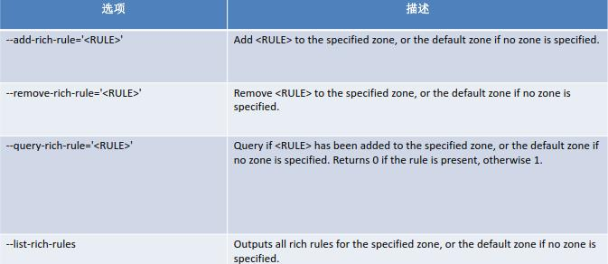

---

### 一. 设置firewall规则

例1：对外暴露8080端口

```
firewall-cmd --permanent --add-port=8080/tcp
```

例2：使mysql服务的3306端口只允许192.168.1.1/24网段的服务器能访问

```
#添加规则
firewall-cmd --permanent --add-rich-rule="rule family="ipv4" source address="192.168.1.1/24" port protocol="tcp" port="3306" accept"

#reload使生效
firewall-cmd --reload
```

例3：端口转发，将到本机的3306端口的访问转发到192.168.1.1服务器的3306端口

```
# 开启伪装IP
firewall-cmd --permanent --add-masquerade
# 配置端口转发
firewall-cmd --permanent --add-forward-port=port=3306:proto=tcp:toaddr=192.168.1.2:toport=13306
```

注意：如果不开启伪装IP，端口转发会失败；其次，要确保源服务器上的端口（3306）和目标服务器上的端口（13306）是开启的。

### 二. firewall命令

##### 1.启动, 停止, 重启firewalld

```
1. 停止
systemctl stop firewalld.service 

2. 启动
systemctl start firewalld.service 

3. 重启
systemctl restart firewalld.service

4. 查看状态： 
systemctl status firewalld 

5.禁止firewall开机启动
systemctl disable firewalld

6. 设置开机启用防火墙：
systemctl enable firewalld.service
```

##### 2.查看firewall规则与状态

```
1. 查看默认防火墙状态（关闭后显示notrunning，开启后显示running）
firewall-cmd --state              

2. 查看防火墙规则（只显示/etc/firewalld/zones/public.xml中防火墙策略）
firewall-cmd --list-all           

3. 查看所有的防火墙策略（即显示/etc/firewalld/zones/下的所有策略）
firewall-cmd --list-all-zones     

4. 重新加载配置文件
firewall-cmd --reload             
```

3.配置firewalld-cmd

```
查看版本： firewall-cmd --version

查看帮助： firewall-cmd --help

显示状态： firewall-cmd --state

查看所有打开的端口： firewall-cmd --zone=public --list-ports

更新防火墙规则： firewall-cmd --reload

查看区域信息:  firewall-cmd --get-active-zones

查看指定接口所属区域： firewall-cmd --get-zone-of-interface=eth0

拒绝所有包：firewall-cmd --panic-on

取消拒绝状态： firewall-cmd --panic-off

查看是否拒绝： firewall-cmd --query-panic
```

##### 4. 那怎么开启一个端口呢

```
1. 添加（--permanent永久生效，没有此参数重启后失效）
firewall-cmd --zone=public --add-port=80/tcp --permanent

2. 重新载入(修改规则后使其生效)
firewall-cmd --reload

3. 查看
firewall-cmd --zone= public --query-port=80/tcp

4. 删除
firewall-cmd --zone= public --remove-port=80/tcp --permanent
 
因为在/usr/lib/firewalld/services/中事先定义了ssh.xml的相应的规则
```

##### 5. systemctl是CentOS7的服务管理工具中主要的工具，它融合之前service和chkconfig的功能于一体。

```
启动一个服务：systemctl start firewalld.service
关闭一个服务：systemctl stop firewalld.service
重启一个服务：systemctl restart firewalld.service
显示一个服务的状态：systemctl status firewalld.service
在开机时启用一个服务：systemctl enable firewalld.service
在开机时禁用一个服务：systemctl disable firewalld.service
查看服务是否开机启动：systemctl is-enabled firewalld.service
查看已启动的服务列表：systemctl list-unit-files|grep enabled
查看启动失败的服务列表：systemctl --failed
```

作者：Joncc

链接：https://www.jianshu.com/p/4a9958d2e859

来源：简书

简书著作权归作者所有，任何形式的转载都请联系作者获得授权并注明出处。


---

# [Linux之iptables(六、rich规则)](https://www.cnblogs.com/duanxin1/p/9860913.html)


> **目录**

**其它规则**

- 当基本firewalld语法规则不能满足要求时，可以使用以下更复杂的规则
- rich-rules 富规则，功能强,表达性语言
- Direct configuration rules 直接规则，灵活性差
- 帮助：man 5 firewalld.direct

**管理rich规则**

- rich规则比基本的firewalld语法实现更强的功能，不仅实现允许/拒绝，还可以实现日志syslog和auditd，也可以实现端口转发，伪装和限制速率
- rich语法：

　　　　rule

[source]
[destination]
service|port|protocol|icmp-block|masquerade|forward-port
[log]
[audit]
[accept|reject|drop]
man 5 firewalld.richlanguage

- man 5 firewalld.richlanguage

**规则**

- 规则实施顺序：
- 该区域的端口转发，伪装规则
- 该区域的日志规则
- 该区域的允许规则
- 该区域的拒绝规则
- 每个匹配的规则生效，所有规则都不匹配，该区域默认规则生效

**rich规则选项**

****

**rich规则示例**

- 拒绝从192.168.0.11的所有流量，当address 选项使用source 或 destination时，必须用family= ipv4 |ipv6

　　firewall-cmd --permanent --zone=classroom --add-rich-rule='rule 
　　family=ipv4 source address=192.168.0.11/32 reject‘

- 限制每分钟只有两个连接到ftp服务

　　firewall-cmd --add-rich-rule=‘rule service name=ftp limit value=2/m accept’

- 抛弃esp（ IPsec 体系中的一种主要协议）协议的所有数据包

　　firewall-cmd --permanent --add-rich-rule='rule protocol value=esp drop'

- 接受所有192.168.1.0/24子网端口5900-5905范围的TCP流量

　　firewall-cmd --permanent --zone=vnc --add-rich-rule='rule family=ipv4 
　　source address=192.168.1.0/24 port port=5900-5905 protocol=tcp accept'

**rich日志规则**

- log [prefix="<PREFIX TEXT>" [level=<LOGLEVEL>] [limit value="<RATE/DURATION>"]
- <LOGLEVEL> 可以是emerg,alert, crit, error, warning, notice, info, debug.
- <DURATION> s：秒, m：分钟, h：小时, d：天
- audit [limit value="<RATE/DURATION>"]

**rich日志规则实例**

- 接受ssh新连接，记录日志到syslog的notice级别，每分钟最多三条信息

firewall-cmd --permanent --zone=work --add-rich-rule='rule service 
name="ssh" log prefix="ssh " level="notice" limit value="3/m" accept

- 从2001:db8::/64子网的DNS连接在5分钟内被拒绝，并记录到日志到audit,每小时最大记录一条信息

　　firewall-cmd --add-rich-rule='rule family=ipv6 source 
　　address="2001:db8::/64" service name="dns" audit limit value="1/h" reject' --timeout=300

 **规则示例**

- firewall-cmd --permanent --add-rich-rule='rule family=ipv4 source address=172.25.X.10/32 service name="http" log level=notice prefix="NEW HTTP " limit value="3/s" accept'
- firewall-cmd --reload
- tail -f /var/log/messages
- curl http://serverX.example.com

**伪装和端口转发**

- NAT网络地址转换，firewalld支持伪装和端口转发两种NAT方式
- 伪装NAT
- firewall-cmd --permanent --zone=<ZONE>
- firewall-cmd --query-masquerade 检查是否允许伪装
- firewall-cmd --add-masquerade 允许防火墙伪装IP
- firewall-cmd --remove-masquerade 禁止防火墙伪装IP
- 示例：
- firewall-cmd --add-rich-rule='rule family=ipv4 address=192.168.0.0/24 masquerade'

**端口转发**

- 端口转发：将发往本机的特定端口的流量转发到本机或不同机器的另一个端口。通常要配合地址伪装才能实现
- firewall-cmd --permanent --zone=<ZONE> --add-forward-port=port=<PORTNUMBER>:proto=<PROTOCOL>[:toport=<PORTNUMBER>][:toaddr=<IPADDR>] 说明：toport= 和toaddr= 至少要指定一个
- 示例：
- 转发传入的连接9527/TCP，到防火墙的80/TCP到public zone 的192.168.0.254
- firewall-cmd --add-masquerade 启用伪装
- firewall-cmd --zone=public --add-forward-
- port=port=9527:proto=tcp:toport=80:toaddr=192.168.0.254

**rich规则**

- rich规则语法：
- forward-port port=<PORTNUM> protocol=tcp|udp [to-port=<PORTNUM>] [to-addr=<ADDRESS>]
- 示例：
- 转发从192.168.0.0/24来的，发往80/TCP的流量到防火墙的端口8080/TCP

firewall-cmd --zone=work --add-rich-rule='rule family=ipv4 source address=192.168.0.0/24 forward-port port=80 protocol=tcp to-port=8080'

**rich规则示例**

- firewall-cmd --permanent --add-rich-rule 'rule family=ipv4 source address=172.25.X.10/32 forward-port port=443 protocol=tcp to-port=22'
- firewall-cmd --reload
- ssh -p 443 serverX.example.com

 

作者：[静默虚空](http://www.cnblogs.com/jingmoxukong/)
欢迎任何形式的转载，但请务必注明出处。
限于本人水平，如果文章和代码有表述不当之处，还请不吝赐教。

---

```shell
# https://www.cnblogs.com/bethal/p/5806525.html
# iptables查看、添加、删除规则
```


